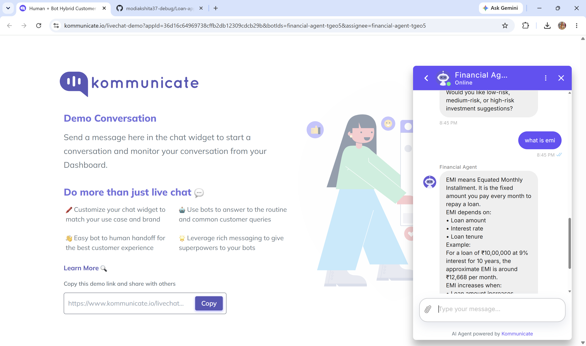

# 💬 AI Financial Assistant Chatbot 

## 📌 Project Overview

This project develops an AI-powered financial assistant chatbot using **Dialogflow ES** and **Kommunicate**.

The chatbot helps users understand personal finance topics such as budgeting, EMI planning, investment options, and tax-saving strategies.

---

# 🎯 Objectives

* Provide financial guidance
* Improve financial awareness
* Demonstrate Conversational AI
* Support personal finance education

---

# 🏗️ Solution Architecture

```text
User Query
      ↓
Dialogflow NLP
      ↓
Intent Detection
      ↓
Response Generation
      ↓
Kommunicate Interface
      ↓
User Response
```

---

# ⚙️ Chatbot Workflow

### Step 1 — User Sends Query

Examples:

* Budget Planning
* EMI Calculation
* Tax Saving
* Investment Advice

### Step 2 — Intent Detection

Dialogflow identifies user intent.

### Step 3 — Response Generation

Relevant financial guidance is generated.

### Step 4 — User Interaction

Response displayed through chatbot interface.

---

# 💰 Budget Planning Intent

Provides:

* Expense Management
* Saving Suggestions
* Budget Planning

---

# 📈 Investment Planning Intent

Provides:

* Investment Basics
* Risk Understanding
* Wealth Creation Guidance

---

# 🏦 EMI Guidance Intent

Provides:

* EMI Explanation
* Loan Repayment Planning
* Interest Awareness

---

# 🧾 Tax Saving Intent

Provides:

* ELSS Information
* PPF Guidance
* Section 80C Benefits

---

# 📸 Project Screenshots

## Budget Planning Intent


---

## Tax Saving Intent


---

## Chatbot Demo


---

# 🛠️ Tech Stack

| Technology               | Purpose             |
| ------------------------ | ------------------- |
| Dialogflow ES            | NLP Processing      |
| Kommunicate              | Chat Interface      |
| Conversational AI        | User Interaction    |
| Financial Knowledge Base | Response Generation |

---

# 📂 Repository Structure

```text
AI-Financial-Assistant-Dialogflow/
│
├── README.md
├── Agent_Export.zip
│
├── screenshots/
│   ├── Budegting_Advice.png
│   ├── Tax_Saving.png
│   └── Chat_bot.png
```

---

# 🚀 How to Run

1. Create Dialogflow Agent
2. Import Agent ZIP
3. Configure Intents
4. Connect Kommunicate
5. Test Chatbot

---

# 💼 Skills Demonstrated

* Conversational AI
* Natural Language Processing
* Financial Advisory Systems
* Chatbot Development

---

# 👨‍💻 Developed By

## Jiya Gupta

MBA (Applied Finance)

AI Agents • NLP • Financial Technology
